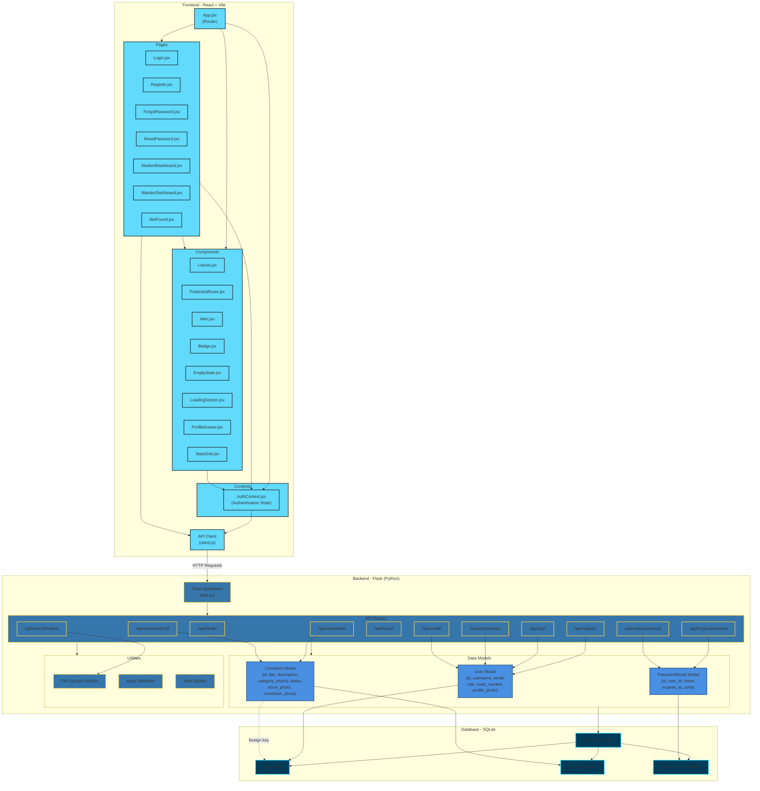

```mermaid
graph TB
    subgraph Frontend["Frontend - React + Vite"]
        App["App.jsx<br/>(Router)"]
        
        subgraph Pages["Pages"]
            LoginPage["Login.jsx"]
            RegisterPage["Register.jsx"]
            ForgotPasswordPage["ForgotPassword.jsx"]
            ResetPasswordPage["ResetPassword.jsx"]
            StudentDashboardPage["StudentDashboard.jsx"]
            WardenDashboardPage["WardenDashboard.jsx"]
            NotFoundPage["NotFound.jsx"]
        end
        
        subgraph Components["Components"]
            Layout["Layout.jsx"]
            ProtectedRoute["ProtectedRoute.jsx"]
            Alert["Alert.jsx"]
            Badge["Badge.jsx"]
            EmptyState["EmptyState.jsx"]
            LoadingScreen["LoadingScreen.jsx"]
            ProfileDrawer["ProfileDrawer.jsx"]
            StatsGrid["StatsGrid.jsx"]
        end
        
        subgraph Contexts["Contexts"]
            AuthContext["AuthContext.jsx<br/>(Authentication State)"]
        end
        
        APIClient["API Client<br/>(client.js)"]
    end
    
    subgraph Backend["Backend - Flask (Python)"]
        FlaskApp["Flask Application<br/>(app.py)"]
        
        subgraph APIRoutes["API Routes"]
            HealthRoute["/api/health"]
            AuthSessionRoute["/api/auth/session"]
            RegisterRoute["/api/register"]
            LoginRoute["/api/login"]
            LogoutRoute["/api/logout"]
            ForgotPasswordRoute["/api/forgot-password"]
            ResetPasswordRoute["/api/reset-password"]
            ProfileRoute["/api/profile"]
            ComplaintsRoute["/api/complaints"]
            ComplaintDetailRoute["/api/complaints/:id"]
            UploadRoute["/uploads/:filename"]
        end
        
        subgraph Models["Data Models"]
            UserModel["User Model<br/>(id, username, email,<br/>role, room_number,<br/>profile_photo)"]
            ComplaintModel["Complaint Model<br/>(id, title, description,<br/>category, priority, status,<br/>issue_photo, resolution_photo)"]
            PasswordResetModel["PasswordReset Model<br/>(id, user_id, token,<br/>expires_at, used)"]
        end
        
        subgraph Utils["Utilities"]
            FileUpload["File Upload Handler"]
            Validation["Input Validation"]
            StatsBuilder["Stats Builder"]
        end
    end
    
    subgraph Database["Database - SQLite"]
        SQLiteDB["hostel_portal.db"]
        UserTable["user table"]
        ComplaintTable["complaint table"]
        PasswordResetTable["password_reset table"]
    end
    
    %% Frontend connections
    App --> Pages
    App --> Components
    App --> AuthContext
    Pages --> Components
    Pages --> AuthContext
    Components --> AuthContext
    AuthContext --> APIClient
    Pages --> APIClient
    
    %% Frontend to Backend
    APIClient -->|HTTP Requests| FlaskApp
    
    %% Backend connections
    FlaskApp --> APIRoutes
    APIRoutes --> Models
    APIRoutes --> Utils
    Models --> SQLiteDB
    
    %% Database connections
    SQLiteDB --> UserTable
    SQLiteDB --> ComplaintTable
    SQLiteDB --> PasswordResetTable
    
    %% Model to Table relationships
    UserModel --> UserTable
    ComplaintModel --> ComplaintTable
    PasswordResetModel --> PasswordResetTable
    ComplaintModel -.->|foreign key| UserTable
    
    %% API Route to Model relationships
    RegisterRoute --> UserModel
    LoginRoute --> UserModel
    AuthSessionRoute --> UserModel
    ProfileRoute --> UserModel
    ComplaintsRoute --> ComplaintModel
    ComplaintDetailRoute --> ComplaintModel
    ForgotPasswordRoute --> PasswordResetModel
    ResetPasswordRoute --> PasswordResetModel
    UploadRoute --> FileUpload
    
    %% Styling
    classDef frontend fill:#61dafb,stroke:#20232a,stroke-width:2px
    classDef backend fill:#3776ab,stroke:#ffd343,stroke-width:2px
    classDef database fill:#003b57,stroke:#00d4ff,stroke-width:2px
    classDef model fill:#4a90e2,stroke:#2c5282,stroke-width:2px
    
    class App,Pages,Components,Contexts,APIClient,LoginPage,RegisterPage,ForgotPasswordPage,ResetPasswordPage,StudentDashboardPage,WardenDashboardPage,NotFoundPage,Layout,ProtectedRoute,Alert,Badge,EmptyState,LoadingScreen,ProfileDrawer,StatsGrid,AuthContext frontend
    class FlaskApp,APIRoutes,HealthRoute,AuthSessionRoute,RegisterRoute,LoginRoute,LogoutRoute,ForgotPasswordRoute,ResetPasswordRoute,ProfileRoute,ComplaintsRoute,ComplaintDetailRoute,UploadRoute,FileUpload,Validation,StatsBuilder backend
    class SQLiteDB,UserTable,ComplaintTable,PasswordResetTable database
    class UserModel,ComplaintModel,PasswordResetModel model
```

